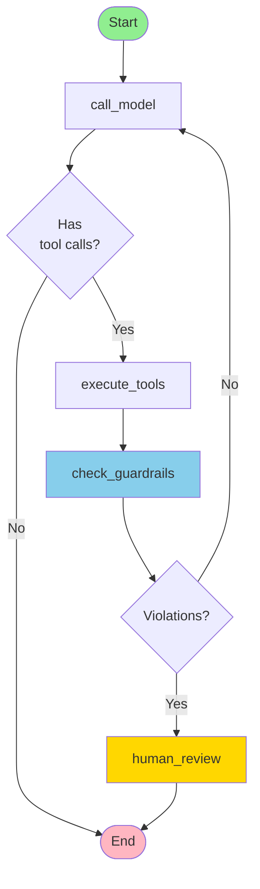

# Tool-Calling Agent with Guardrails

A LangGraph agent that prevents infinite loops and excessive resource usage with smart guardrails.

## The Problem

Tool-calling agents can loop forever, wasting money and frustrating users:

```python
# Agent gets stuck:
search("X") → search("X") → search("X") → ... 💸💸💸
```

## The Solution

```python
# Our guardrails stop it:
if tool_calls > 3 or tokens_per_min > 15000:
    return human_review(trace_id)
```

**4 Key Guardrails:**
1. ✅ Hard cap: Max 3 tool calls per turn
2. ✅ Token limit: 15,000 tokens/minute
3. ✅ Exponential backoff with jitter
4. ✅ Human review escalation with trace IDs

## Graph Flow



## Quick Start

### Installation

#### Env Setup
copy `.env.example` to `.env` and update values

#### Install dependencies

```bash
pip install -e .

# OR with dev(to test) and llm
pip install -e '.[dev,llm]'
```

##### Start the server
```bash
langgraph dev
```

### Run Examples

```bash
python examples.py
```

### Test in Studio

See **[Testing in Studio](#testing-in-studio)** below for copy-paste JSON examples.

## Testing in Studio

### Test 1: Normal Operation (Success)

Paste this JSON in the Studio input fields:

```json
{
  "messages": [
    {
      "content": "What's the current time?",
      "type": "human"
    }
  ],
  "guardrail_metrics": {
    "tool_calls_this_turn": 0,
    "total_tool_calls": 0,
    "tokens_last_minute": 0,
    "retry_count": 0,
    "violations": [],
    "last_token_reset": 0,
    "trace_id": "00000000-0000-0000-0000-000000000000"
  },
  "config": {
    "max_tool_calls_per_turn": 3,
    "max_tokens_per_minute": 15000,
    "enable_exponential_backoff": true,
    "base_retry_delay": 1.0,
    "max_retry_delay": 30.0,
    "enable_human_review": true
  },
  "human_review_reason": "",
  "needs_human_review": false
}
```

**Expected:** ✅ Tool called, no violations, success

---

### Test 2: Tool Call Limit (Violation)

```json
{
  "messages": [
    {
      "content": "Search for many things",
      "type": "human"
    }
  ],
  "guardrail_metrics": {
    "tool_calls_this_turn": 3,
    "total_tool_calls": 3,
    "tokens_last_minute": 0,
    "retry_count": 0,
    "violations": [],
    "last_token_reset": 0,
    "trace_id": "00000000-0000-0000-0000-000000000000"
  },
  "config": {
    "max_tool_calls_per_turn": 3,
    "max_tokens_per_minute": 15000,
    "enable_exponential_backoff": true,
    "base_retry_delay": 1.0,
    "max_retry_delay": 30.0,
    "enable_human_review": true
  },
  "human_review_reason": "",
  "needs_human_review": false
}
```

**Expected:** ⚠️ Violation "Tool call limit exceeded: 4/3" → Human review

---

### Test 3: Token Limit (Violation)

```json
{
  "messages": [
    {
      "content": "Quick question",
      "type": "human"
    }
  ],
  "guardrail_metrics": {
    "tool_calls_this_turn": 0,
    "total_tool_calls": 0,
    "tokens_last_minute": 16000,
    "retry_count": 0,
    "violations": [],
    "last_token_reset": 0,
    "trace_id": "00000000-0000-0000-0000-000000000000"
  },
  "config": {
    "max_tool_calls_per_turn": 3,
    "max_tokens_per_minute": 15000,
    "enable_exponential_backoff": true,
    "base_retry_delay": 1.0,
    "max_retry_delay": 30.0,
    "enable_human_review": true
  },
  "human_review_reason": "",
  "needs_human_review": false
}
```

**Expected:** 🔴 Violation "Token rate limit exceeded: 16000/15000" → Human review

---

### Test 4: Multiple Violations

```json
{
  "messages": [
    {
      "content": "Do everything!",
      "type": "human"
    }
  ],
  "guardrail_metrics": {
    "tool_calls_this_turn": 4,
    "total_tool_calls": 4,
    "tokens_last_minute": 18000,
    "retry_count": 0,
    "violations": [],
    "last_token_reset": 0,
    "trace_id": "00000000-0000-0000-0000-000000000000"
  },
  "config": {
    "max_tool_calls_per_turn": 3,
    "max_tokens_per_minute": 15000,
    "enable_exponential_backoff": true,
    "base_retry_delay": 1.0,
    "max_retry_delay": 30.0,
    "enable_human_review": true
  },
  "human_review_reason": "",
  "needs_human_review": false
}
```

**Expected:** Both violations detected → Human review

## Configuration

Default guardrail limits:

```python
{
    "max_tool_calls_per_turn": 3,      # Stop after 3 tool calls
    "max_tokens_per_minute": 15000,    # Token budget
    "enable_exponential_backoff": True, # Smart retries
    "base_retry_delay": 1.0,           # 1 second base
    "max_retry_delay": 30.0,           # 30 second max
    "enable_human_review": True        # Escalate violations
}
```

## Core Implementation

### Guardrail Check

```python
def check_guardrails(state: AgentState) -> dict[str, Any]:
    metrics = get_metrics(state)
    config = state.get("config", DEFAULT_GUARDRAILS)
    violations = []
    
    # Check tool call limit
    if metrics.tool_calls_this_turn >= config["max_tool_calls_per_turn"]:
        violations.append(f"Tool call limit exceeded: {metrics.tool_calls_this_turn}/{config['max_tool_calls_per_turn']}")
    
    # Check token limit
    if metrics.tokens_last_minute > config["max_tokens_per_minute"]:
        violations.append(f"Token rate limit exceeded: {metrics.tokens_last_minute}/{config['max_tokens_per_minute']}")
    
    # Escalate if violations
    needs_review = len(violations) > 0 and config.get("enable_human_review", True)
    
    return {
        "guardrail_metrics": metrics.to_dict(),
        "needs_human_review": needs_review,
        "human_review_reason": "; ".join(violations) if violations else "",
    }
```

## Key Features

### Trace IDs for Debugging

Every execution gets a unique trace ID:

```
2025-11-19 11:51:36 - INFO - [d831288a-f62d-4b5c-a3e6-101537d115fa] - Calling model
2025-11-19 11:51:36 - INFO - [N/A] - Executing search_web (tool context)
```

### Exponential Backoff

Smart retry delays to avoid hammering APIs:

```python
delay = base_delay * (2 ** retry_count) + jitter
# Retry 1: ~1s, Retry 2: ~2s, Retry 3: ~4s, etc.
```

### Human Review

When violations occur, escalate with full context:

```
🔴 HUMAN REVIEW REQUIRED 🔴

Trace ID: d831288a-f62d-4b5c-a3e6-101537d115fa
Reason: Tool call limit exceeded: 4/3

Metrics:
- Tool calls this turn: 4
- Total tool calls: 4
- Tokens last minute: 0
```

## Production Checklist

This is a **reference implementation**. For production:

- [ ] Replace simulated `call_model` with real LLM (OpenAI, Anthropic, etc.)
- [ ] Implement actual tools (not mocked)
- [ ] Add API key management
- [ ] Set up monitoring/alerts
- [ ] Add persistence for metrics
- [ ] Implement human review workflow
- [ ] Add authentication
- [ ] Security audit
- [ ] Load testing

## Common Issues

### Logging Errors

If you see `ValueError: Formatting field not found in record: 'trace_id'`:

✅ **Fixed!** The code uses `TraceIdFilter` to handle this automatically.

### AttributeError

If you see `'dict' object has no attribute 'trace_id'`:

✅ **Fixed!** Use `get_metrics()` helper to convert dicts to objects.

### Studio Not Loading

```bash
# Restart the server
Ctrl+C
langgraph dev
```

## Contributing

This is a learning resource. Feel free to:
- Fork and customize
- Submit improvements
- Share your patterns

## License

MIT License

## Credits

- [LangGraph](https://github.com/langchain-ai/langgraph) - Orchestration
- [LangChain](https://github.com/langchain-ai/langchain) - LLM framework
- [LangSmith](https://smith.langchain.com/) - Observability

---

**Remember: The best agent knows when to stop!**